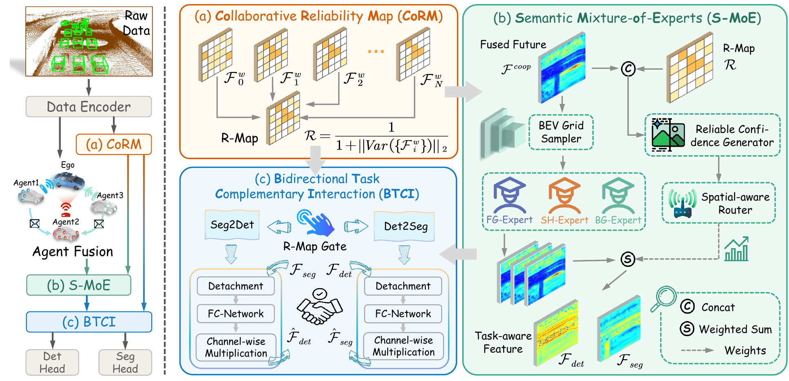

# CoDS

Official implementation of **CoDS: Robust Collaborative Perception via Expert-driven Detection and BEV Segmentation** (ACM Multimedia 2026).

[](https://arxiv.org/abs/2608.14085) 
[](https://github.com/JinlongW128/CoDS)
[](https://openi.pcl.ac.cn/OpenAIDriving/CoDS)
[](https://github.com/JinlongW128/CoDS)


<p align="center">
  
</p>

<!-- *Note: As this code was reorganized a long time after the original experiments, some implementation details may have been inadvertently overlooked. We sincerely apologize for any such omissions.* -->

## Abstract

Collaborative perception breaks through single-view limitations via multi-agent information exchange. However, multi-source noise such as pose errors and communication delays degrades fusion feature quality, constraining perception performance. Joint training of detection and BEV segmentation provides a natural remedy, where segmented road regions help constrain target distributions and detection bounding boxes help recover ambiguous segmentation boundaries. To this end, we propose a robust Collaborative perception framework with expert-driven Detection and BEV Segmentation (CoDS). To address spatial inconsistency in fusion quality, we first introduce the Collaborative Reliability Map (CoRM) to explicitly quantify feature quality distribution. Based on CoRM, we design the Semantic Mixture-of-Experts (S-MoE) module to extract differentiated features for inconsistent feature demands. Finally, to further mitigate feature noise degradation, the Bidirectional Task Complementary Interaction (BTCI) refines task-aware features through bidirectional injection. Extensive experiments on OPV2V and V2V4Real datasets show that our CoDS surpasses existing baselines on both tasks and maintains stable robustness under multi-source noise.

## Installation

CoDS requires an NVIDIA GPU and a CUDA-enabled PyTorch installation. 

```bash
conda create -n cods python=3.8 -y
conda activate cods
```

Install a CUDA-compatible PyTorch build and spconv, then install the project dependencies:

```bash
pip install torch==1.12.0+cu116 \
    torchvision==0.13.0+cu116 \
    torchaudio==0.12.0 \
    --extra-index-url https://download.pytorch.org/whl/cu116

pip install spconv-cu116==2.3.6
pip install -r requirements.txt
pip install -e .
```

Compile the bounding-box overlap extension:

```bash
python opencood/utils/setup.py build_ext --inplace
```

For additional dependency notes, pypcd installation, and alternative spconv setups, see [INSTALL.md](./INSTALL.md).

Verify the environment before training:

```bash
python -c "import torch, spconv; print(torch.__version__); print(torch.cuda.is_available())"
```

The final value should be `True`.

## Dataset Preparation

### OPV2V

Download the official [OPV2V dataset](https://mobility-lab.seas.ucla.edu/opv2v/). CoDS additionally requires BEV segmentation annotations for dynamic objects, roads, lanes, and visible regions.

The expected directory structure is:

```text
OPV2V/
├── train/
│   └── <scenario>/<cav_id>/
│       ├── <timestamp>.pcd
│       ├── <timestamp>.yaml
│       └── <camera images>
├── validate/
├── test/
└── additional/
    ├── train/
    │   └── <scenario>/<cav_id>/
    │       ├── <timestamp>_bev_dynamic.png
    │       ├── <timestamp>_bev_static.png
    │       ├── <timestamp>_bev_lane.png
    │       ├── <timestamp>_bev_visibility.png
    │       └── <timestamp>_bev_visibility_corp.png
    ├── validate/
    └── test/
```

Update the dataset paths in both official configuration files:

```yaml
root_dir: "/path/to/OPV2V/train"
validate_dir: "/path/to/OPV2V/validate"
test_dir: "/path/to/OPV2V/test"
```

The data loader automatically resolves each extra annotation from the matching `additional/<split>/<scenario>/<cav_id>/` directory. For compatibility with previously prepared datasets, it also accepts these annotations directly inside the corresponding raw CAV directory.

## Training

All commands below should be run from the repository root:

```bash
cd /path/to/CoDS
conda activate cods
```

### Single-GPU training

```bash
CUDA_VISIBLE_DEVICES=0 python opencood/tools/train.py \
    --hypes_yaml path/to/yaml \
```

Training outputs are written to `opencood/logs/`. Each experiment directory contains the resolved `config.yaml`, TensorBoard events, loss logs, and model checkpoints.

### Multi-GPU training

The default paper setup uses two GPUs. For example:

```bash
CUDA_VISIBLE_DEVICES=0,1 python -m torch.distributed.launch \
    --nproc_per_node=2 \
    --master_port=45673 \
    --use_env \
    opencood/tools/train_ddp.py \
    --hypes_yaml path/to/yaml \
```

### Resume training

Use `--model_dir` to resume from the latest `net_epoch*.pth` checkpoint in an experiment directory:

```bash
CUDA_VISIBLE_DEVICES=0 python opencood/tools/train.py \
    --hypes_yaml path/to/yaml \
    --model_dir opencood/logs/<experiment_directory>
```

When `--model_dir` is provided, the saved `config.yaml` in that directory is loaded.

## Evaluation

Run joint detection and segmentation evaluation with:

```bash
CUDA_VISIBLE_DEVICES=0 python opencood/tools/inference_detseg.py \
    --model_dir opencood/logs/<experiment_directory> \
    --fusion_method intermediate \
    --eval_epoch xx
```

Useful options include:

| Argument | Description |
|---|---|
| `--eval_epoch` | Checkpoint epoch to evaluate. |
| `--save_vis` | Save BEV and 3D visualizations. |
| `--save_vis_interval` | Visualization interval in frames. |
| `--save_npy` | Save point clouds, predictions, and ground truth as NumPy files. |
| `--no_score` | Hide detection confidence values in visualization output. |
| `--note` | Append a custom suffix to the evaluation name. |

Example with visualization:

```bash
CUDA_VISIBLE_DEVICES=0 python opencood/tools/inference_detseg.py \
    --model_dir opencood/logs/<experiment_directory> \
    --fusion_method intermediate \
    --eval_epoch xx \
    --save_vis \
    --save_vis_interval 10
```

Evaluation results are appended to:

```text
<experiment_directory>/result.txt
```

## Citation

If you find this project useful in your research, please cite:

```bibtex
@article{wang2026cods,
  title={CoDS: Robust Collaborative Perception via Expert-driven Detection and BEV Segmentation},
  author={Wang, Jinlong and Jia, Yuang and Lin, Junhong and Li, Nannan and Gao, Wei},
  journal={arXiv preprint arXiv:2608.14085},
  year={2026}
}
```

## Acknowledgements

This repository is built upon the following projects and datasets:

- [OpenCOOD](https://github.com/DerrickXuNu/OpenCOOD)
- [BM2CP](https://github.com/byzhaoAI/BM2CP)
- [OPV2V](https://mobility-lab.seas.ucla.edu/opv2v/)
- [V2V4Real](https://mobility-lab.seas.ucla.edu/v2v4real/)
- [CoBEVT](https://github.com/DerrickXuNu/CoBEVT/tree/main)

We thank their authors for making their code and data available to the collaborative perception community.
